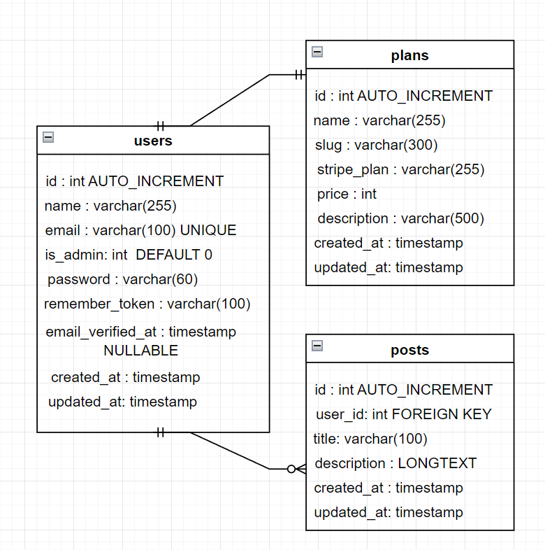

## What is Blog Bridge?

Blog Bridge is a simple online publishing platform (something like medium) with membership options. The publishing platform allows a user to create blog posts that includes a <b>title</b> and a <b>description</b>. Users can choose their own membership package from the membersip option and make the payment process via stripe payment system. The `core` folder of the project contains the frontend design, API Endpoints and the environment variables.

## Key Features

### User Type

We have two kinds of users, `admin` and `end user`. The user types are denoted by Enums.

```sh
    <?php

    namespace App\Enums;

    interface UserType
    {
        const USER = 0;
        const ADMIN = 1;
    }
```
### Membership Plan

There are two types of membership plans that a user can choose. As a user, he/she can upgrade or downgrade their membership plan based on their current membership plan status. The types of plans are shown here:

```sh
    "Plan": [
      {
        "id": 0,
        "name": "Free"
      },
      {
        "id": 1,
        "name": "Premium"
      }
    ]
```

#### Free Plan

* Free members will be able to create 2 posts (maximum) daily.
* Can edit or update their own posts.
* Can upgrade to premium plan if he/she wills.

#### Premium Plan

* Premium members will be able to create unlimited posts daily.
* Can edit or update their own posts.
* Can schedule their posts and the posts will be automatically published at their scheduled time. <i>(task still ongoing)</i>
* Can downgrade to free plan, but will lose all the premium plan package priviledges.

## Database Schema

The db schema of the project is shown below:

 <p align="center">
   
</p>

## Installation

To run this project, you need to have these installed on your local machine.

* [PHP](https://www.php.net/downloads.php)
* [Composer](https://getcomposer.org/)
* [MySQL](https://www.mysql.com/downloads/)
* [Apache](https://httpd.apache.org/download.cgi) or [Nginx](http://nginx.org/en/download.html)
* [npm](https://www.npmjs.com/package/download)

After downloading the project from github, you need to follow these commands:

* Switch to the `core` folder and make a copy of `.env.example` into your local `.env`

```sh
    cp .env.example .env
```
* Run composer install command to install/reload the project dependencies

```sh
    composer install
```
* Then run this command to generate the application key

```sh
    php artisan key:generate
```
* Give access to the storage folder of the project

```sh
    chmod -R 777 storage/
```
* For table migration to the database, run the command below

```sh
    php artisan migrate
```
* After migration, you can start the server

```sh
    php artisan serve
```
* Now open another terminal and run npm for loading the frontend dependencies

```sh
   npm install && run dev
```

After installation, check at http://127.0.0.1:8000/ to view your application.
